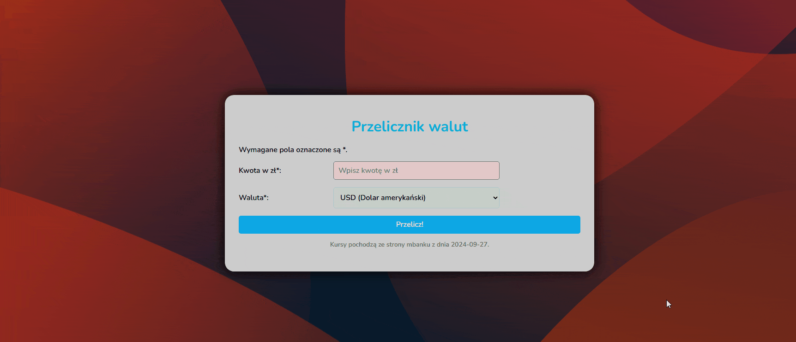

# Currency converter

Hi ! I present a simple currency converter.

(screenshot)

## Table of contents

- [Description](#description)
- [How to use](#How-to-use)
- [Technologies](#Technologies-used-in-the-project)
- [link to the page](#visit-the-website)

## Description

This simple and powerful web app was built in React to allow users to quickly convert PLN amounts to selected foreign currencies: Swiss franc (CHF), euro (EUR), pound sterling (GBP), and US dollar (USD). It's very user-friendly.The project is constantly updated.

## How to use

1. Enter the amount in PLN.
2. Select currency (for example GBP/EUR)
3. Click the Calculate button.
4. The app will display the converted value.

## Technologies Used in the Project 🛠️

- React: A library for building user interfaces.
- Styled Components: For defining component styles, ensuring dynamic and easy theme management.
- Hooks: Use custom hooks (e.g. useCurrentDate) to manage the logic of retrieving data and the current time.
- CSS Grid / Flexbox: For responsive element arrangement

## visit the website

Visit my website here:[Demo](https://maciekinit.github.io/currency-converter-react/)

# Getting Started with Create React App

This project was bootstrapped with [Create React App](https://github.com/facebook/create-react-app).

## Available Scripts

In the project directory, you can run:

### `npm start`

Runs the app in the development mode.\
Open [http://localhost:3000](http://localhost:3000) to view it in your browser.

The page will reload when you make changes.\
You may also see any lint errors in the console.

### `npm run build`

Builds the app for production to the `build` folder.\
It correctly bundles React in production mode and optimizes the build for the best performance.

The build is minified and the filenames include the hashes.\
Your app is ready to be deployed!

See the section about [deployment](https://facebook.github.io/create-react-app/docs/deployment) for more information.

## Learn More

You can learn more in the [Create React App documentation](https://facebook.github.io/create-react-app/docs/getting-started).

To learn React, check out the [React documentation](https://reactjs.org/).

### Code Splitting

This section has moved here: [https://facebook.github.io/create-react-app/docs/code-splitting](https://facebook.github.io/create-react-app/docs/code-splitting)

### Analyzing the Bundle Size

This section has moved here: [https://facebook.github.io/create-react-app/docs/analyzing-the-bundle-size](https://facebook.github.io/create-react-app/docs/analyzing-the-bundle-size)

### Making a Progressive Web App

This section has moved here: [https://facebook.github.io/create-react-app/docs/making-a-progressive-web-app](https://facebook.github.io/create-react-app/docs/making-a-progressive-web-app)

### Advanced Configuration

This section has moved here: [https://facebook.github.io/create-react-app/docs/advanced-configuration](https://facebook.github.io/create-react-app/docs/advanced-configuration)

### Deployment

This section has moved here: [https://facebook.github.io/create-react-app/docs/deployment](https://facebook.github.io/create-react-app/docs/deployment)

### `npm run build` fails to minify

This section has moved here: [https://facebook.github.io/create-react-app/docs/troubleshooting#npm-run-build-fails-to-minify](https://facebook.github.io/create-react-app/docs/troubleshooting#npm-run-build-fails-to-minify)
